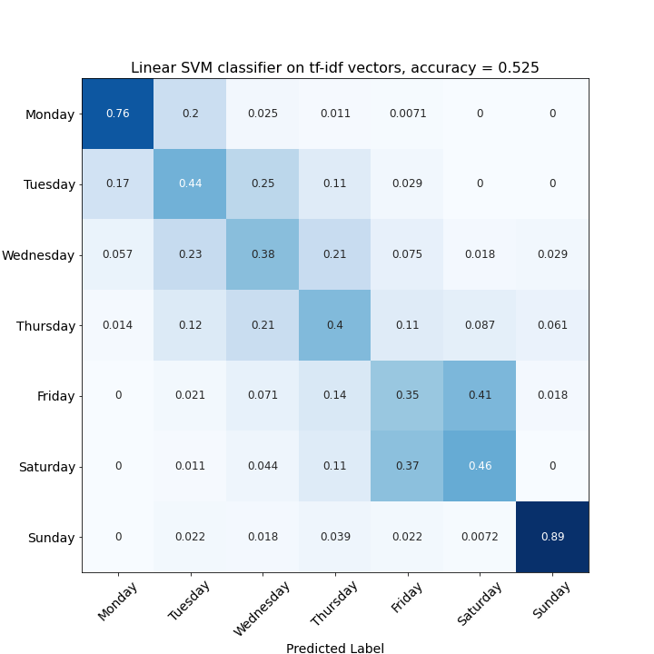

# Predicting difficulty in NY Times Crossword puzzles

	

## [Erdős Code May 2021 Bootcamp](https://www.erdosinstitute.org/code) Final Project
Group 21 - Crossword Validation. Members:
- Caitlin Carpenter
- Nick Danis
- Jonathan Viereck

## Description
Every regular NYT Crossword fan knows that Monday is the easiest and the end of the week is most difficult. Given an arbitrary crossword puzzle, can we predict what day it was from?

## Organization of repository

The [plots](/plots) directory contains explanations on the feature definitions. The [models](/models) directory contains notebooks on the models trained, with cross-validation details. The [scraper](/scraper) directory contains the notebook used for data scraping, in addition to some sample raw data. (The full raw data is not included for copyright reasons.) The CSV files [jv-features.csv](jv-features.csv) and [cc-features.csv](cc-features.csv) contain the feature values for the metadata analysis of the puzzles. 

## Feature Selection
We scraped 27 years of NYT Crossword puzzle data (Jan 1, 1994-Jan 1, 2021, essentially the entire Will Shortz era to date), collecting clue/answer text as well as other puzzle metadata such as puzzle size, number of black blocks, and authors, from [https://www.xwordinfo.com/](xwordinfo.com). All totaled, the data set contains 815332 clue/answer pairs. Neither the scraper nor the retrieved dataset are stored in this repository. 

The clue/answer pairs and puzzle metadata were used to construct features for the classification models from the set of roughly 10k different crossword puzzles. Puzzle features considered were:

| Feature                         | Name in notebook  | Description                                                                     |
|---------------------------------|-------------------|---------------------------------------------------------------------------------|
| Block Density                   | `BlockDensity`    | Number of black blocks / total grid size                                        |
| Average answer length           | `AvgAnswerLength` | Average length of the answers in characters                                     |
| Average hint length             | `AvgHintLength`   | Average length of the clues in characters                                       |
| Hint rarity                     | `OtherPuzAns`     | The number of other puzzles that each clue occurs in, averaged for each puzzle  |
| Percentage of one-word hints    | `PctOneWordHints` | The percentage of the clues that consist of only one word                       |
| Percentage of wordplay clues    | `PctWP`           | The percentage of clues that end in a question mark                             |
| Percentage of proper noun clues | `PctPNC`          | The percentage of clues that contain a proper noun (non-initial capital letter) |

Additionally, the following features were computed:

- **Answers in previous puzzles, normed**: The number of times a puzzle's clues have appeared in *previous* puzzles, by date. 

- **Perplexity Outliers**: A character bigram language model is trained on all puzzle answers using [nltk](http://www.nltk.org/)'s [Maximum Likelihood Estimation model](https://www.nltk.org/api/nltk.lm.html). [Perplexity](https://en.wikipedia.org/wiki/Perplexity) is calculated for each answer, and the number of **perplexity outliers** (those with perplexity score S where $S > Q_3 + 1.5*IQR$) are counted for each puzzle. The intuition here is that answers that are more rare or obscure should have a higher perplexity score, and that certain days of the week might have on average more ansers of this type than others. Examples of low perplexity answers and high perplexity answers are given below.

| Low perplexity example   |    score | High perplexity example   |    score |
|:-------------------------|------------:|:--------------------------|-------------:|
| STRAND                   |     9.28925 | UFO                       |      26.0607 |
| ORACHE                   |     9.07991 | USSR                      |      25.1    |
| ADORE                    |     8.51231 | ADHD                      |      32.5389 |
| ABRADES                  |     9.93018 | GNU                       |      35.6054 |
| BES                      |     7.94344 | KOI                       |      32.4649 |
| TEA                      |     9.91122 | IZAAK                     |      34.1267 |
| STENO                    |     8.71083 | CCC                       |      31.3426 |
| EATIN                    |     9.47551 | VSO                       |      34.8022 |
| HERE                     |     7.61904 | NRC                       |      41.678  |
| ILE                      |     8.80969 | KPS                       |      30.5141 |

Note that perplexity isn't (necessarily) affected by answer length, but rather the likelihood of certain two-character sequences occuring in a given answer. 

### Illustrative examples

#### Average answer length            

#### Hint rarity

 

- **Bag of Words** and **Term frequency - Inverse document frequency (tf-idf)**: Each puzzle was considered as a documents by joining all its hints into a single string, and were represented with Bag-of-words and tf-idf vectors using the `sklearn` functions `CountVectorizer()` and `TfidfVectorizer()`.

## Models

1. (ND/CC) Using the features computed from puzzle metadata, cross-validation was used to determine the most relavent subset of features for fitting K nearest neighbors, decision tree, and random forest models.

2. (JV) Using the Bag of Words and tfidf vector representations, we considered linear SVM, random forest, boosted decision tree, and feed-forward neural network models to classify the data, using cross-validation for optimization of decision tree and neural network hyperperameters. 

## Results

Testing accuracies for classification on metadata can be compared to the bag-of-words and tf-idf classification models. In both cases testing accuracies were around 50%, compared to random guessing of about 15%

Metadata            |  Bag of Words & tf-idf
:-------------------------:|:-------------------------:
  |  

Out of the models tested, the linear SVM model on tf-idf vectors achieved the highest accuracy of 52.5%. 

The confusion matrices for every model tested are all qualitatively similar to the one above. Weekly puzzles can be broken up into three  irreducible categories: (1) Sunday was by far the easiest to classify, which is unsurprising given that Sunday puzzles are larger and contain more information than puzzles from other days of the week (2) Friday and Saturday were difficult to separate from each other, but easy to separate from (3) Monday, Tuesday, Wednesday, Thursday, which were also difficult to separate from each other. 

## Next steps

- Improve the classification of the individual days based on more sophisticated language models.
- It would be interesting to find out if the crossword puzzles from other major newspapers follow the same trends. Lastly, 
- Include a parser for the `.puz` file format to allow read-in and classification of new puzzles. 

## Acknowledgements

Special thanks to Humberto Gilmer. 
